# EDOC 2021 Prototype

This use case demonstrates the functionalities of the MODULO framework comprising the [QuantME Transformation Framework](https://github.com/UST-QuAntiL/QuantME-TransformationFramework), the [OpenTOSCA ecosystem](https://github.com/OpenTOSCA), and the [Camunda BPMN engine](https://camunda.com/products/camunda-platform/bpmn-engine/).
For this, it comprises:

1. Modeling of a quantum workflow implementing [Simon's algorithm](https://qiskit.org/textbook/ch-algorithms/simon.html) using the Quantum Modeling Extension (QuantME).

2. Transformation of the modeled quantum workflow to a native BPMN workflow using QuantME Replacement Models (QRMs), retaining the workflow portability between different BPMN engines.

3. Self-contained packaging of the native BPMN workflow model together with deployment models for all required services to enable the transmission of only a single archive into the target environment.

4. Automatically deploying the required services using the deployment models, binding them with the workflow activities, and deploying the workflow model to the Camunda BPMN engine.

5. Execution of the workflow accessing the deployed services, as well as quantum computers, solving Simon's problem for the input data of the user.

## Setting up the MODULO Framework

First, we will discuss the steps required to set up the different components comprising the MODULO framework.
All components except the [QuantME Transformation Framework](https://github.com/UST-QuAntiL/QuantME-TransformationFramework) providing the graphical BPMN modeler are available via Docker.
Therefore, these components can be started using the Docker-Compose file available [here](./docker):

1. Update the [.env](./docker/.env) file with your settings: 
  * ``PUBLIC_HOSTNAME``: Enter the hostname/IP address of your Docker engine. Do *not* use ``localhost``.

2. Run the Docker-Compose file:
```
docker-compose pull
docker-compose up --build
```

3. Wait until all containers are up and running. This may take some minutes.

To start the QuantME Transformation Framework, please execute the following steps:

1. Clone the repository using release v1.3.0: 
```
git clone https://github.com/UST-QuAntiL/QuantME-TransformationFramework.git --branch v1.3.0
```

2. Move to the cloned folder and build the framework:
```
npm install
npm run build
```

3. The build product can be found in the ``dist`` folder and started depending on the operating system, e.g., using the ``.exe`` for Windows.

Afterwards, the following screen should be displayed:


## Preparations

The MODULO framework relies on the availability of reusable deployment models and QuantME Replacement Models (QRMs) to transform quantum workflows and deploy required services.
Next, the modeling of an exemplary deployment model, as well as QRM, is presented.

### Modeling Deployment Models

Deployment models are defined using the [TOSCA standard](http://docs.oasis-open.org/tosca/TOSCA/v1.0/TOSCA-v1.0.html) in the MODULO framework.
Hence, we utilize the graphical TOSCA modeling tool [Winery](https://github.com/OpenTOSCA/winery) to define the required deployment models.

Open Winery using the following URL: ``$PUBLIC_HOSTNAME:8093``


Winery already contains all required deployment models for this demonstration, except one, which is later used to mitigate readout-errors of quantum computations on quantum computers from [IBMQ](https://quantum-computing.ibm.com/).
Thus, this deployment model is created by clicking ``Add new`` on the top-right, and then inserting ``IbmMitigationService`` as name and ``http://quantil.org/quantme/pull`` as namespace:


Next, the topology is modeled by opening the ``Topology Template`` tab and clicking on the ``Open Editor`` button:


On the left, you can see the available Node Types, which can be added by drag-and-drop to the topology.
Add a ``Docker Engine`` and an ``IbmMitigationServiceContainer_w1-wip1`` to the topology and connect them by a ``HostedOn`` relation, as depicted in the figure below.
Then, click on the ``Properties`` button on the top and open the properties of both components.
Add the following values to the properties:

* ``Docker Engine``:

    * DockerEngineURL: ``tcp://dind:2375`` (this is the docker engine endpoint to use to deploy the required container)
    * State: ``Running`` (indicating that the Docker engine was already started and must not be deployed)
    
* ``IbmMitigationServiceContainer_w1-wip1``:

    * ContainerPort: ``80`` (the port to use for the created container)
    * ENV_CAMUNDA_ENDPOINT: ``get_input: camundaEndpoint`` (the endpoint of the Camunda engine to pull task objects)
    * ENV_CAMUNDA_TOPIC: ``get_input: camundaTopic`` (the topic to use to pull for task objects)
    
Thereby, by using ``get_input``, these values are dynamically passed when creating an instance of the modeled service.


Finally, add the deployment artifact implementing the functionality of the service to the ``IbmMitigationServiceContainer_w1-wip1`` component.
For this, click on the ``Deployment Artifacts`` button on the top and afterwards at the ``IbmMitigationServiceContainer_w1-wip1``.
Then, select ``Add new Deployment Artifact`` showing the following window:

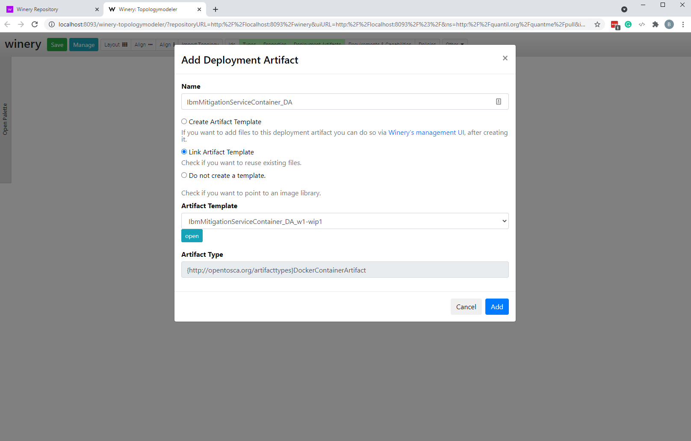

Use ``IbmMitigationServiceContainer_DA`` as name and select ``Link Artifact Template``.
Then, chose ``IbmMitigationServiceContainer_DA_w1-wip1`` from the drop-down menu and click on ``Add``.
Finally, store the created deployment model using the ``Save`` button at the top-left.

In case you experience any problems during modeling or deployment of this service, please refer to the [Troubleshooting](#troubleshooting) section at the end of this README.

### Modeling QuantME Replacement Models (QRMs)

In the next step, we will create a QuantME Replacement Model (QRM) that can be used to replace ``ReadoutErrorMitigationTask`` modeling constructs (see [Quantum4BPMN](https://github.com/UST-QuAntiL/QuantME-Quantum4BPMN)) in a workflow by an implementing workflow fragment.
Thereby, this workflow fragment will invoke the service for which we created a deployment model in the previous section.

TODO

## QuantME Modeling

In the first step of the MODULO method, the quantum workflow is modeled using the modeling constructs provided by the Quantum Modeling Extension (QuantME).
For this, open a new BPMN diagram in the modeler by clicking ``File``, ``New File``, and select ``BPMN Diagram``.
Then, store the new workflow as ``simons-algorithm.bpmn``, as we will implement a workflow executing Simon's algorithm in this demonstration.
Add two new tasks to the workflow by dragging them from the palette on the left into the workflow.
Select ``Quantum Computation Task`` as task type for the first task and ``User Task`` for the second.
Afterwards, add an ``End Event`` to the workflow and connect all modeling elements as depicted in the figure below:

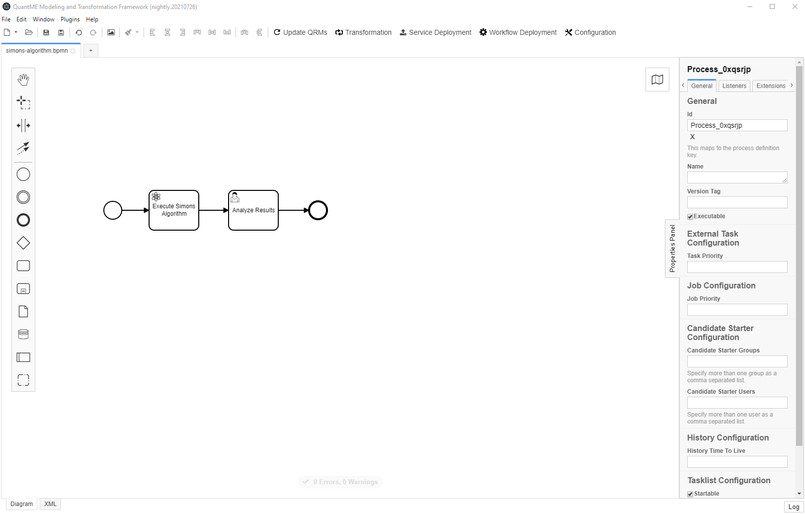

Next, the ``Quantum Computation Task`` is configured by selecting it and adding the required properties displayed at the bottom-right.
Add ``simon`` for the ``Algorithm`` property, indicating the algorithm to execute, and ``ibmq`` as ``Provider`` defining that quantum computers or simulators from IBM should be used to execute the quantum circuits in the workflows.

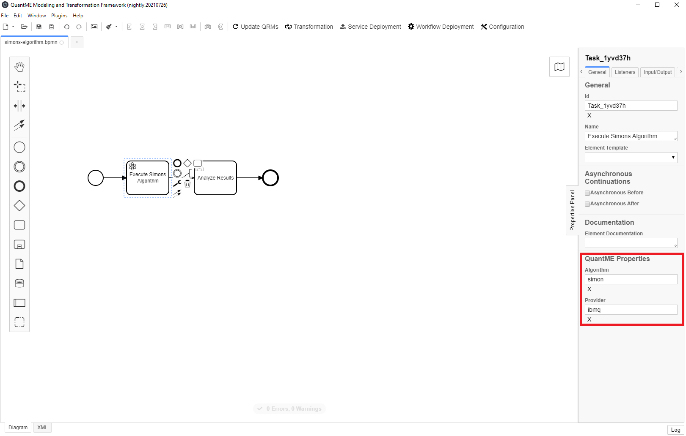

Finally, we define the required input parameters for the quantum workflow.
Select the ``Start Event`` and click on the ``Form`` tab in the property panel on the right.
Then, click on the ``+`` sign to add a new input parameter.
Define the properties as displayed in the figure below.
Thereby, the input parameter is used to request the oracle from the user representing Simon's problem to solve by the workflow execution.
Details on how and in which format to pass this information to a newly created workflow instance is presented in the [workflow execution section](#workflow-execution).

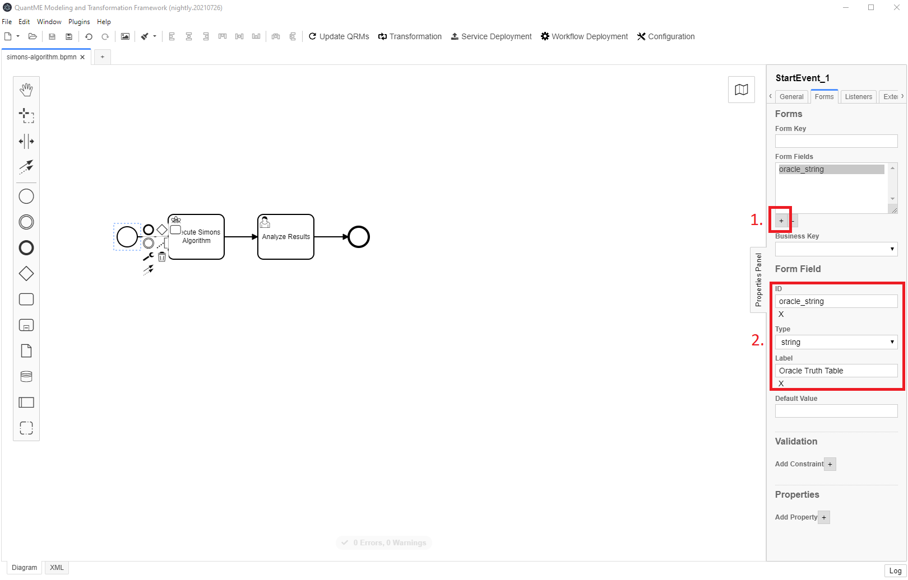

In addition, a second input parameter is required, retrieving the access token from the user to access quantum computers or simulators available over the [IBM Quantum Experience](https://quantum-computing.ibm.com/).
Add the required information as shown in the next figure:


Afterwards, the modeling of the quantum workflow is finished, and it can now be transformed, deployed, and executed in the next steps.
The resulting workflow model is available in XML format [here](./workflow/modulo-abstract-workflow.bpmn) and can be used to verify the modeling result or as input for the following steps.

## QuantME Transformation

TODO

## Self-Contained Packaging

TODO

## Deployment

In the next step, the required services are deployed, bound to the workflow, and the workflow model is uploaded to the Camunda BPMN engine for execution.

First, initiate the deployment of the services by clicking on the ``Service Deployment`` button in the toolbar:


In the pop-up, an overview of the services to deploy is given, together with the information to which service task they belong and how they are bound to the workflow.
Click on ``Upload CSARs`` to upload the CSARs containing the deployment models to the [OpenTOSCA Container](https://github.com/OpenTOSCA/container), a TOSCA-compliant deployment system.
Wait until the upload process terminates, and the next step is displayed in the pop-up:


The modal shows all required input parameters to create the service instances.
However, for the specified deployment models, all information is already defined within the deployment models.
Thus, no additional parameters have to be provided.
Next, click on the ``Deploy Services`` button.
This may take a few minutes, as some of the services are based on Qiskit, and the download takes some time depending on the internet connection.
When the deployment finishes, the last part of the service deployment modal is shown:


Finally, click on ``Perform Binding`` to automatically configure the workflow with the required information to invoke the deployed service instances.
If the binding was successful, a corresponding pop-up is displayed (see figure below).
Afterwards, the workflow model is executable.
Thus, it is uploaded to the Camunda engine that was started using the Docker-Compose file by clicking on the ``Workflow Deployment`` button on the top:

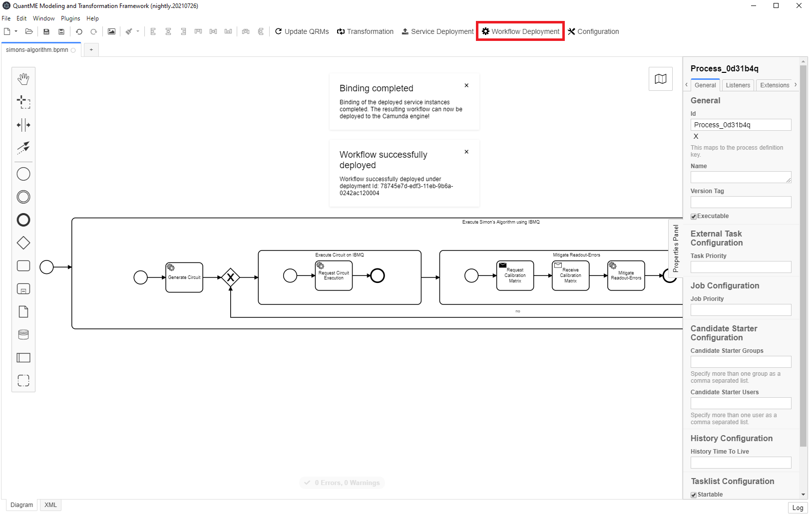

Thereby, another pop-up is displayed after the successful deployment of the workflow model.
If the workflow deployment fails, please have a look at the logs of the Docker-Compose file and the Troubleshooting section at the [end of this file](#troubleshooting).

## Workflow Execution

After successfully deploying all required services and the workflow model, open the URL of the Camunda BPMN engine: ``$PUBLIC_HOSTNAME:8080/camunda``

First, create an account in the Camunda engine and log in. 
Then, the following screen is displayed:


Switch to the Camunda cockpit application by clicking on the top-right and selecting Cockpit:

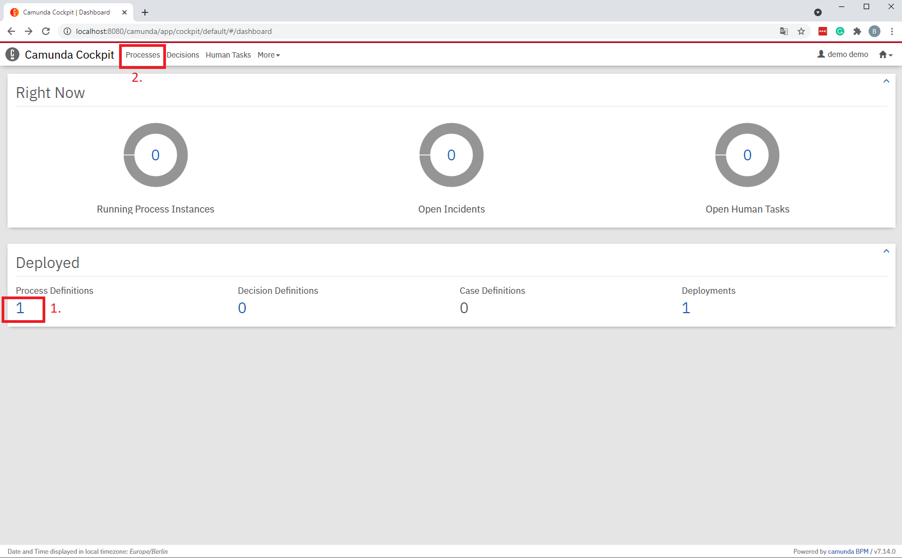

If the workflow model was successfully deployed in the [deployment step](#deployment), a 1 should be displayed under the Process Definitions label. 
Click on Processes on the top to get a list of all deployed workflow models:


Select the previously modeled and deployed workflow model by clicking on its name, which opens a view where the workflow model is shown. 
In this view, the token flow can be observed during workflow execution, i.e., it is visualized which activity of the workflow model is currently executed. 
Furthermore, the current values of the different variables in the workflow are displayed. 
To execute the workflow, open another tab with the Camunda tasklist application by clicking on the top-right and selecting Tasklist:


To instantiate the workflow model, select Start process on the top-right and click on the name of the workflow in the pop-up menu. 
Next, the required input parameters for the instantiation are shown, which were defined in the start event form during modeling:


Provide your IBMQ access token, which can be retrieved from the [IBM Quantum Experience website](https://quantum-computing.ibm.com/), as well as the truth table defining the oracle that should be used for the workflow execution.
Thereby, we utilize the Qiskit functionality for the generation of the corresponding quantum circuits, thus, it can be defined as discussed in the [Qiskit documentation](https://qiskit.org/documentation/stubs/qiskit.aqua.components.oracles.TruthTableOracle.html).
For this example, the following truth table ``['01101001', '10011001', '01100110']`` is used, which results in the hidden bit string ``s=011``.

After entering the input parameters, click on ``Start``.
The UI displays a notification at the bottom-right that the workflow instance was successfully started.
Switch back to the Camunda cockpit application in the first tab to observe the token flow in the workflow:

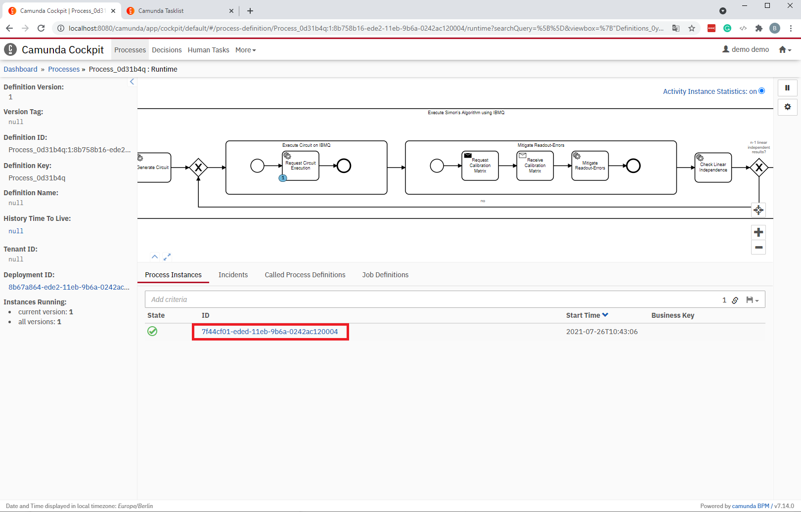

Click on the corresponding workflow instance at the bottom, to view more details, such as the current values of the variables.
Wait until the token reaches the final user task in the workflow as depicted below:

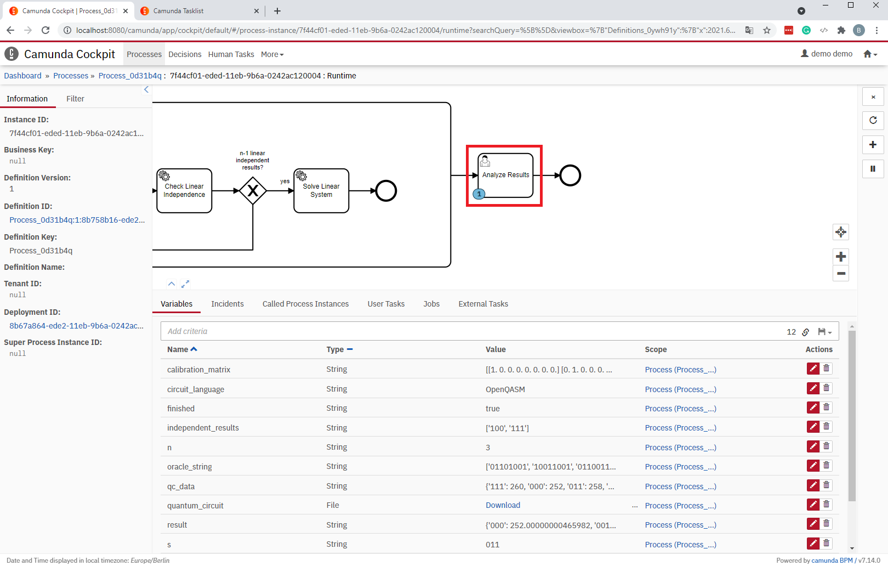

To analyze the resulting bitstring ``s`` in the user task, switch to the tasklist tab.
Click on ``Add a simple filter`` on the left, and then, the user tasks should be visible in the task list as shown below:

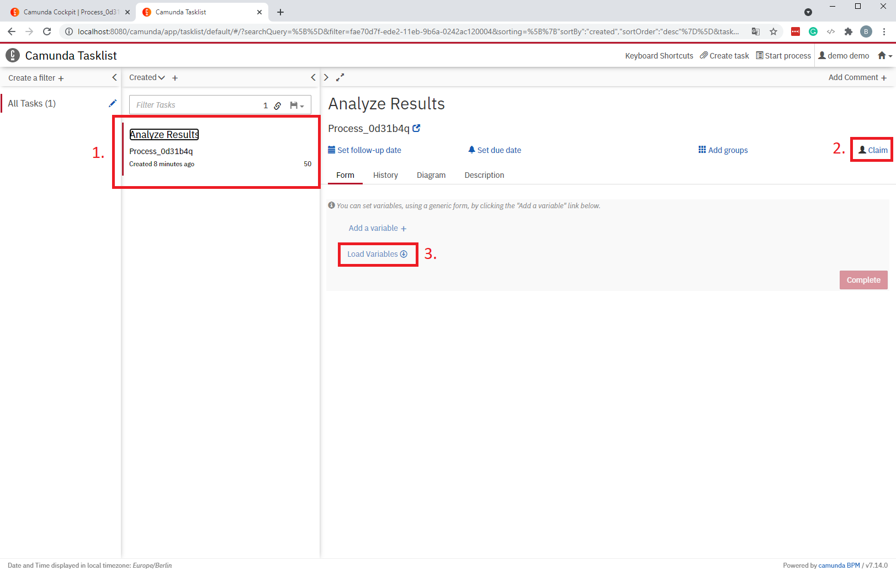

Next, click on the task and the ``Claim`` button on the right.
Finally, click on ``Load Variables``, which displays the value of all variables:

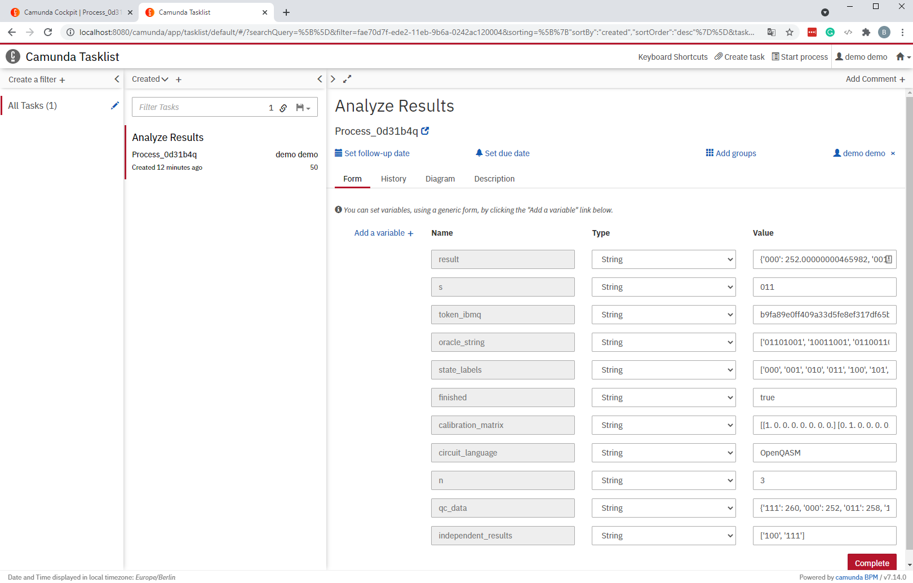

Search for the variable with the name ``s``, which has the value ``011`` in our example, providing the solution for Simon's problem and the given oracle. 
By pressing the Complete button, the workflow instance terminates.

To terminate the environment, close the QuantME Transformation Framework and execute the following command in the [folder](./docker) with the Docker-Compose file: ``docker-compose down -v``

## Troubleshooting

The ServiceTemplate created in the ``Modeling Deployment Models`` section is available in XML format [here](./docs/ibm-mitigation-service-template.tosca), which can be used to verify the modeling result or replace it in case there are any issues.
For this, open the ServiceTemplate in Winery, select the ``XML`` tab, and compare the displayed XML with the provided (see below).
Additionally, the provided XML can also be copied into the field and stored using the ``Save`` button.

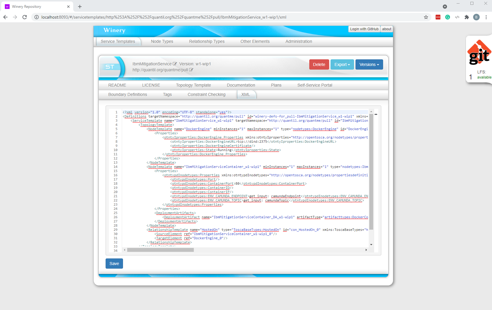
