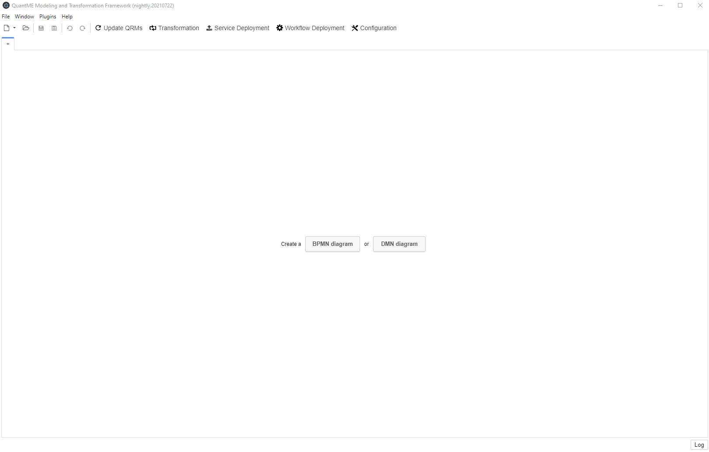

# EDOC 2021 Prototype

TODO

## Setting up the MODULO Framework

First, we will discuss the steps required to set up the different components comprising the MODULO framework.
All components except the [QuantME Transformation Framework](https://github.com/UST-QuAntiL/QuantME-TransformationFramework) providing the graphical BPMN modeler are available via Docker.
Therefore, these components can be started using the Docker-Compose file available [here](./docker):

1. Update the [.env](./docker/.env) file with your settings: 
  * ``PUBLIC_HOSTNAME``: Enter the hostname/IP address of your Docker engine. Do *not* use ``localhost``.

2. Run the Docker-Compose file:
```
docker-compose pull
docker-compose up --build
```

3. Wait until all containers are up and running. This may take some minutes.

To start the QuantME Transformation Framework, please execute the following steps:

1. Clone the repository using release v1.3.0: 
```
git clone https://github.com/UST-QuAntiL/QuantME-TransformationFramework.git --branch v1.3.0
```

2. Move to the cloned folder and build the framework:
```
npm install
npm run build
```

3. The build product can be found in the ``dist`` folder and started depending on the operating system, e.g., using the ``.exe`` for Windows.

Afterwards, the following screen should be displayed:



## Preparations

The MODULO framework relies on the availability of reusable deployment models and QuantME Replacement Models (QRMs) to transform quantum workflows and deploy required services.
Next, the modeling of an exemplary deployment model, as well as QRM, is presented.

### Modeling Deployment Models

Deployment models are defined using the [TOSCA standard](http://docs.oasis-open.org/tosca/TOSCA/v1.0/TOSCA-v1.0.html) in the MODULO framework.
Hence, we utilize the graphical TOSCA modeling tool [Winery](https://github.com/OpenTOSCA/winery) to define the required deployment models.

Open Winery using the following URL: ``$PUBLIC_HOSTNAME:8093``


Winery already contains all required deployment models for this demonstration, except one, which is later used to mitigate readout-errors of quantum computations on quantum computers from [IBMQ](https://quantum-computing.ibm.com/).
Thus, this deployment model is created by clicking ``Add new`` on the top-right, and then inserting ``IbmMitigationService`` as name and ``http://quantil.org/quantme/pull'' as namespace:


TODO

### Modeling QuantME Replacement Models (QRMs)

TODO

## QuantME Modeling

TODO

## QuantME Transformation

TODO

## Self-Contained Packaging

TODO

## Deployment

TODO

## Workflow Execution

TODO

## Troubleshooting

TODO
