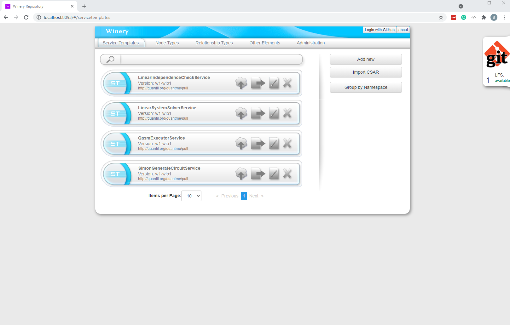
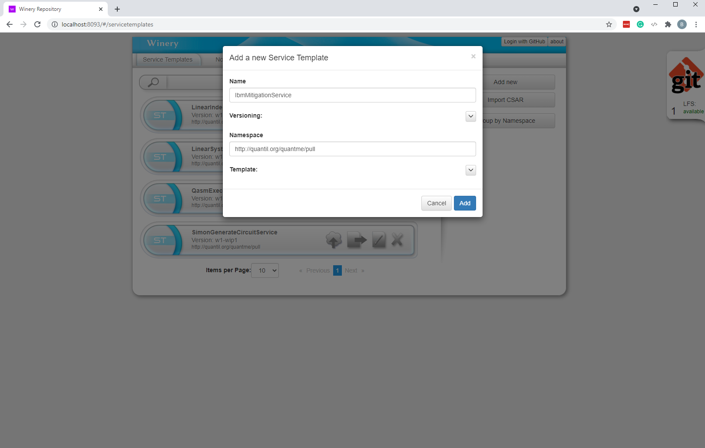
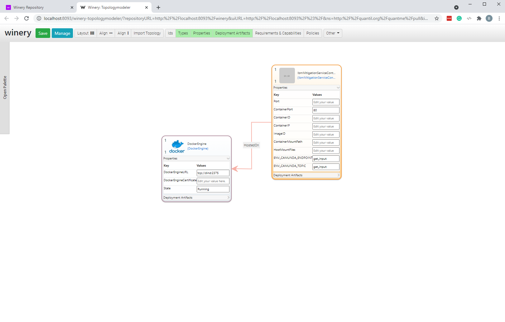

# EDOC 2021 Prototype

This use case demonstrates the functionalities of the MODULO framework comprising the [QuantME Transformation Framework](https://github.com/UST-QuAntiL/QuantME-TransformationFramework), the [OpenTOSCA ecosystem](https://github.com/OpenTOSCA), and the [Camunda BPMN engine](https://camunda.com/products/camunda-platform/bpmn-engine/).
For this, it comprises:

1. Modeling of a quantum workflow implementing [Simon's algorithm](https://qiskit.org/textbook/ch-algorithms/simon.html) using the Quantum Modeling Extension (QuantME).

2. Transformation of the modeled quantum workflow to a native BPMN workflow using QuantME Replacement Models (QRMs), retaining the workflow portability between different BPMN engines.

3. Self-contained packaging of the native BPMN workflow model together with deployment models for all required services to enable the transmission of only a single archive into the target environment.

4. Automatically deploying the required services using the deployment models, binding them with the workflow activities, and deploying the workflow model to the Camunda BPMN engine.

5. Execution of the workflow accessing the deployed services, as well as quantum computers, solving Simon's problem for the input data of the user.

## Setting up the MODULO Framework

First, we will discuss the steps required to set up the different components comprising the MODULO framework.
All components except the [QuantME Transformation Framework](https://github.com/UST-QuAntiL/QuantME-TransformationFramework) providing the graphical BPMN modeler are available via Docker.
Therefore, these components can be started using the Docker-Compose file available [here](./docker):

1. Update the [.env](./docker/.env) file with your settings: 
  * ``PUBLIC_HOSTNAME``: Enter the hostname/IP address of your Docker engine. Do *not* use ``localhost``.

2. Run the Docker-Compose file:
```
docker-compose pull
docker-compose up --build
```

3. Wait until all containers are up and running. This may take some minutes.

To start the QuantME Transformation Framework, please execute the following steps:

1. Clone the repository using release v1.3.0: 
```
git clone https://github.com/UST-QuAntiL/QuantME-TransformationFramework.git --branch v1.3.0
```

2. Move to the cloned folder and build the framework:
```
npm install
npm run build
```

3. The build product can be found in the ``dist`` folder and started depending on the operating system, e.g., using the ``.exe`` for Windows.

Afterwards, the following screen should be displayed:


## Preparations

The MODULO framework relies on the availability of reusable deployment models and QuantME Replacement Models (QRMs) to transform quantum workflows and deploy required services.
Next, the modeling of an exemplary deployment model, as well as QRM, is presented.

### Modeling Deployment Models

Deployment models are defined using the [TOSCA standard](http://docs.oasis-open.org/tosca/TOSCA/v1.0/TOSCA-v1.0.html) in the MODULO framework.
Hence, we utilize the graphical TOSCA modeling tool [Winery](https://github.com/OpenTOSCA/winery) to define the required deployment models.

Open Winery using the following URL: ``$PUBLIC_HOSTNAME:8093``



Winery already contains all required deployment models for this demonstration, except one, which is later used to mitigate readout-errors of quantum computations on quantum computers from [IBMQ](https://quantum-computing.ibm.com/).
Thus, this deployment model is created by clicking ``Add new`` on the top-right, and then inserting ``IbmMitigationService`` as name and ``http://quantil.org/quantme/pull`` as namespace:



Next, the topology is modeled by opening the ``Topology Template`` tab and clicking on the ``Open Editor`` button:


On the left, you can see the available Node Types, which can be added by drag-and-drop to the topology.
Add a ``Docker Engine`` and an ``IbmMitigationServiceContainer_w1-wip1`` to the topology and connect them by a ``HostedOn`` relation, as depicted in the figure below.
Then, click on the ``Properties`` button on the top and open the properties of both components.
Add the following values to the properties:

* ``Docker Engine``:

    * DockerEngineURL: ``tcp://dind:2375`` (this is the docker engine endpoint to use to deploy the required container)
    * State: ``Running`` (indicating that the Docker engine was already started and must not be deployed)
    
* ``IbmMitigationServiceContainer_w1-wip1``:

    * ContainerPort: ``80`` (the port to use for the created container)
    * ENV_CAMUNDA_ENDPOINT: ``get_input: camundaEndpoint`` (the endpoint of the Camunda engine to pull task objects)
    * ENV_CAMUNDA_TOPIC: ``get_input: camundaTopic`` (the topic to use to pull for task objects)
    
Thereby, by using ``get_input``, these values are dynamically passed when creating an instance of the modeled service.



Finally, add the deployment artifact implementing the functionality of the service to the ``IbmMitigationServiceContainer_w1-wip1`` component.
For this, click on the ``Deployment Artifacts`` button on the top and afterwards at the ``IbmMitigationServiceContainer_w1-wip1``.
Then, select ``Add new Deployment Artifact`` showing the following window:


Use ``IbmMitigationServiceContainer_DA`` as name and select ``Link Artifact Template``.
Then, chose ``IbmMitigationServiceContainer_DA_w1-wip1`` from the drop-down menu and click on ``Add``.
Finally, store the created deployment model using the ``Save`` button at the top-left.

In case you experience any problems during modeling or deployment of this service, please refer to the [Troubleshooting](#troubleshooting) section at the end of this README.

### Modeling QuantME Replacement Models (QRMs)

In the next step, we will create a QuantME Replacement Model (QRM) that can be used to replace ``ReadoutErrorMitigationTask`` modeling constructs (see [Quantum4BPMN](https://github.com/UST-QuAntiL/QuantME-Quantum4BPMN)) in a workflow by an implementing workflow fragment.
Thereby, this workflow fragment will invoke the service for which we created a deployment model in the previous section.

TODO

## QuantME Modeling

TODO

## QuantME Transformation

TODO

## Self-Contained Packaging

TODO

## Deployment

TODO

## Workflow Execution

After successfully deploying all required services and the workflow model, open the URL of the Camunda BPMN engine: ``$PUBLIC_HOSTNAME:8080/camunda``

First, create an account in the Camunda engine and log in. Then, the following screen is displayed:

TODO

## Troubleshooting

The ServiceTemplate created in the ``Modeling Deployment Models`` section is available in XML format [here](./docs/ibm-mitigation-service-template.tosca), which can be used to verify the modeling result or replace it in case there are any issues.
For this, open the ServiceTemplate in Winery, select the ``XML`` tab, and compare the displayed XML with the provided (see below).
Additionally, the provided XML can also be copied into the field and stored using the ``Save`` button.


