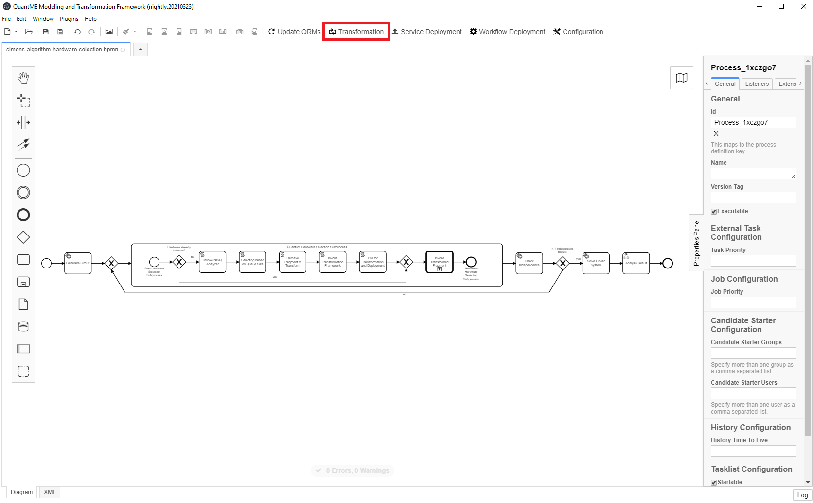

# Electronics 2021 - Special Issue "Quantum Computing System Design and Architecture" - Prototype

This use case shows how to specify Quantum4BPMN workflow models independent of a quantum computer by using a *QuantumHardwareSelectionSubprocess*.
The quantum computer is then automatically selected during workflow runtime, and the QuantME modeling constructs within the QuantumHardwareSelectionSubprocess are dynamically replaced by suitable workflow fragments based on the selected quantum computer.

The following figure shows a workflow model implementing Simon's algorithm:


Furthermore, it is available in XML format [here](./workflow/simons-algorithm-hardware-selection.bpmn).
In the following, the different steps to execute the workflow model including the dynamic hardware selection are presented.

Please refer to the *Troubleshooting* section at the end of this README if you have some issues during execution!

## Setting up the Environment

Next, we will discuss the steps required to set-up the environment to model and execute the workflow model.

### Running the QuantME Transformation Framework

First, build and run the [QuantME Transformation Framework](https://github.com/UST-QuAntiL/QuantME-TransformationFramework):

1. Clone the repository using release v1.2.0: 
```
git clone https://github.com/UST-QuAntiL/QuantME-TransformationFramework.git --branch v1.2.0
```
2. Change to the cloned folder and build the framework:
```
npm install
npm run build
```
3. The build product can be found in the ``dist`` folder and started depending on the operating system, e.g., using the ``.exe`` for Windows

The QuantME Transformation Framework can be configured on start-up by passing in corresponding environment variables. 
However, we will update the configuration using the graphical user interface:

Open the configuration window:


Update the different configuration properties using the following values.
Thereby, $IP has to be replaced with the IP-address of the Docker engine if you use the Docker setup (see bellow):

* ``Camunda Engine Endpoint``: http://$IP:8080/engine-rest
* ``OpenTOSCA Endpoint``: http://$IP:1337/csars
* ``Winery Endpoint``: http://$IP:8093/winery
* ``QRM Repository User``: UST-QuAntiL
* ``QRM Repository Name``: QuantME-UseCases
* ``QRM Repository Path``: /2021-electronics/QRMs


### Running the OpenTOSCA and QuAntiL Components

All other required service can be started using the Docker-Compose file located in [this folder](./docker):

1. Update the [.env](./docker/.env) file with your settings: 
  * ``PUBLIC_HOSTNAME``: Enter the hostname/IP address of your Docker engine. Do *not* use ``localhost``.
  * ``IBM_ACCESS_TOKEN``: Enter your IBM access token which is needed to retrieve the required provenance data by [QProv](https://github.com/UST-QuAntiL/qprov). It can be obtained using the [IBM Quantum Experience](https://quantum-computing.ibm.com/) UI.

2. Run the Docker-Compose file:
```
docker-compose pull
docker-compose up --build
```

3. Wait until all containers are up and running. This may take some minutes.

## Model the Workflow and Transform it to Native BPMN

Next, the workflow model implementing Simon's algorithm is imported into QuantME Transformation Framework:

* Click on ``File`` in the top-left corner of the QuantME Transformation Framework
* Select ``Open File...``
* Navigate to the workflow model available in this repository (see [here](./workflow/simons-algorithm-hardware-selection.bpmn)) and open it

The workflow model should now be visible in the QuantME Transformation Framework:


Click on the ``Transformation`` button on the top to transform the workflow model into a native BPMN workflow model, which is afterwards visible in the modeler:



In the next step, the required services for the service tasks in the workflow are deployed.
Thereby, only the service instances for the tasks outside the QuantumHardwareSelectionSubprocess are created, as the other services are deployed on-demand after the hardware selection on workflow runtime.
Thus, three services are deployed in this step.
To initiate the deployment, click on the ``Service Deployment`` button on the top of the modeler:

TODO

## Execute the Workflow using the Camunda Engine

TODO

## Troubleshooting

The [docker-compose file](./docker/docker-compose.yml) for the setup of the environment uses the release *v1.1.1* of [QProv](https://github.com/UST-QuAntiL/qprov).
However, the IBMQ API may change over time and the retrieval of the required provenance data does not work as expected anymore.
Therefore, please have a look if a newer relase is available in case you have any issues regarding QProv.

The setup for this use case requires a lot of services from the OpenTOSCA ecosystem, as well as the QuAntil ecosystem.
Thus, make sure the used Docker engine has access to enough resources and increase them, e.g., if the provisioning of a service instance for the different task fails.
