# Electronics 2021 - Special Issue "Quantum Computing System Design and Architecture" - Prototype

This use case shows how to specify Quantum4BPMN workflow models independent of a quantum computer by using a *QuantumHardwareSelectionSubprocess*.
The quantum computer is then automatically selected during workflow runtime, and the QuantME modeling constructs within the QuantumHardwareSelectionSubprocess are dynamically replaced by suitable workflow fragments based on the selected quantum computer.

The following figure shows a workflow model implementing Simon's algorithm:


Furthermore, it is available in XML format [here](./workflow/simons-algorithm-hardware-selection.bpmn).
In the following, the different steps to execute the workflow model including the dynamic hardware selection are presented.

Please refer to the *Troubleshooting* section at the end of this README if you have some issues during execution!

## Setting up the Environment

Next, we will discuss the steps required to set-up the environment to model and execute the workflow model.

### Running the QuantME Transformation Framework

First, build and run the [QuantME Transformation Framework](https://github.com/UST-QuAntiL/QuantME-TransformationFramework):

1. Clone the repository using release v1.2.0: 
```
git clone https://github.com/UST-QuAntiL/QuantME-TransformationFramework.git --branch v1.2.0
```
2. Change to the cloned folder and build the framework:
```
npm install
npm run build
```
3. The build product can be found in the ``dist`` folder and started depending on the operating system, e.g., using the ``.exe`` for Windows

The QuantME Transformation Framework can be configured on start-up by passing in corresponding environment variables. 
However, we will update the configuration using the graphical user interface:

Open the configuration window:

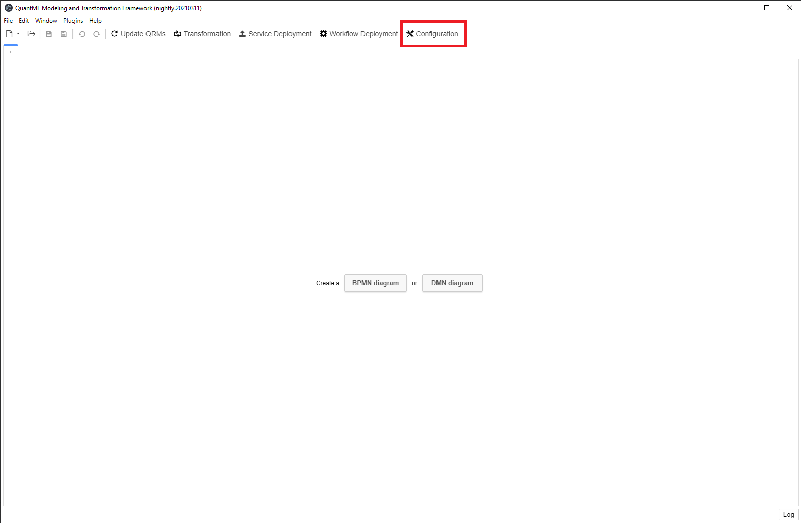

Update the different configuration properties using the following values.
Thereby, $IP has to be replaced with the IP-address of the Docker engine if you use the Docker setup (see bellow):

* ``Camunda Engine Endpoint``: http://$IP:8080/engine-rest
* ``OpenTOSCA Endpoint``: http://$IP:1337/csars
* ``Winery Endpoint``: http://$IP:8093/winery
* ``QuantME Framework Endpoint``: http://$IP:8888
* ``NISQ Analyzer Endpoint``: http://$IP:8099/nisq-analyzer
* ``QRM Repository User``: UST-QuAntiL
* ``QRM Repository Name``: QuantME-UseCases
* ``QRM Repository Path``: /2021-electronics/QRMs

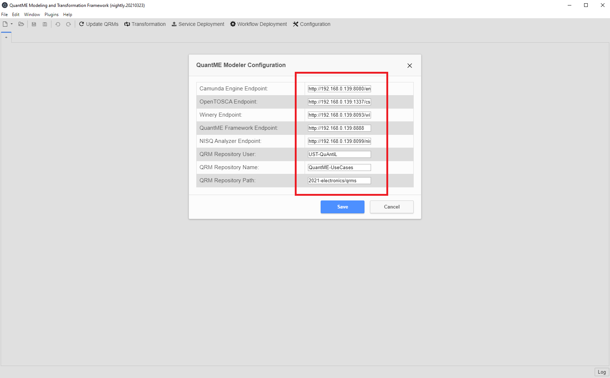

### Running the OpenTOSCA and QuAntiL Components

All other required service can be started using the Docker-Compose file located in [this folder](./docker):

1. Update the [.env](./docker/.env) file with your settings: 
  * ``PUBLIC_HOSTNAME``: Enter the hostname/IP address of your Docker engine. Do *not* use ``localhost``.
  * ``IBM_ACCESS_TOKEN``: Enter your IBM access token which is needed to retrieve the required provenance data by [QProv](https://github.com/UST-QuAntiL/qprov). It can be obtained using the [IBM Quantum Experience](https://quantum-computing.ibm.com/) UI.

2. Run the Docker-Compose file:
```
docker-compose pull
docker-compose up --build
```

3. Wait until all containers are up and running. This may take some minutes.

## Model the Workflow and Transform it to Native BPMN

Next, the workflow model implementing Simon's algorithm is imported into QuantME Transformation Framework:

* Click on ``File`` in the top-left corner of the QuantME Transformation Framework
* Select ``Open File...``
* Navigate to the workflow model available in this repository (see [here](./workflow/simons-algorithm-hardware-selection.bpmn)) and open it

The workflow model should now be visible in the QuantME Transformation Framework:


Click on the ``Transformation`` button on the top to transform the workflow model into a native BPMN workflow model, which is afterwards visible in the modeler:


In the next step, the required services for the service tasks in the workflow are deployed.
Thereby, only the service instances for the tasks outside the QuantumHardwareSelectionSubprocess are created, as the other services are deployed on-demand after the hardware selection on workflow runtime.
Thus, three services are deployed in this step.
To initiate the deployment, click on the ``Service Deployment`` button on the top of the modeler:

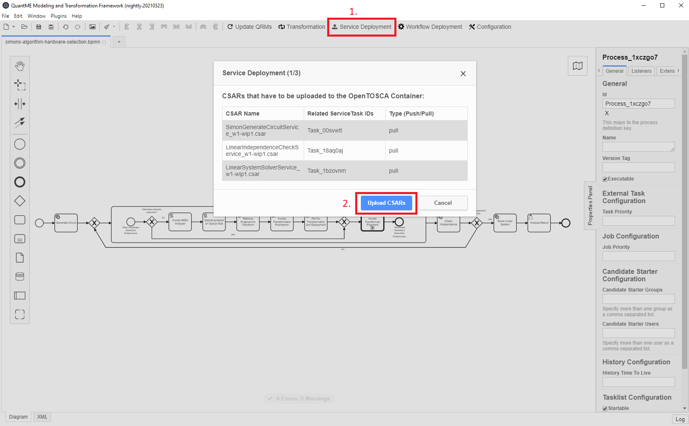

In the modal, an overview of the services to deploy is given.
Click on ``Upload CSARs`` to upload the CSARs containing the deployment models to the [OpenTOSCA Container](https://github.com/OpenTOSCA/container), a TOSCA-compliant deployment system.
Wait until the upload process terminates and the next step is displayed in the modal:

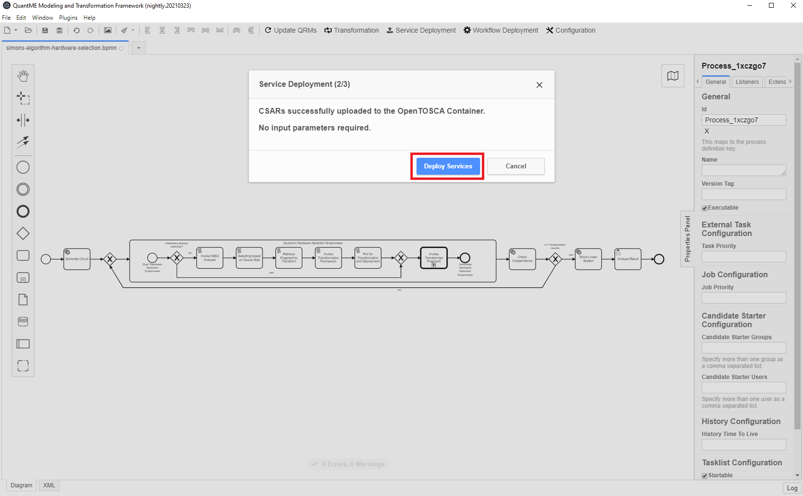

The modal shows all required input parameters to create the service instances.
However, for the specified deployment models, all information is already specified.
Thus, no additional parameters have to be provided.
Next, click on the ``Deploy Services`` button.
This may take a few minutes, as the service to generate the circuits for Simon's algorithm is based on Qiskit, and the download takes some time depending on the internet connection.
When the deployment finishes, the last part of the service deployment modal is shown:


Finally, click on ``Perform Binding`` to automatically configure the workflow with the required information to invoke the deployed service instances.
If the binding was successful, a corresponding pop-up is displayed (see figure bellow).
Afterwards, the workflow model is executable.
Thus, it is deployed to the Camunda engine that was started using the Docker -Compose file by clicking on the ``Workflow Deployment`` button on the top:

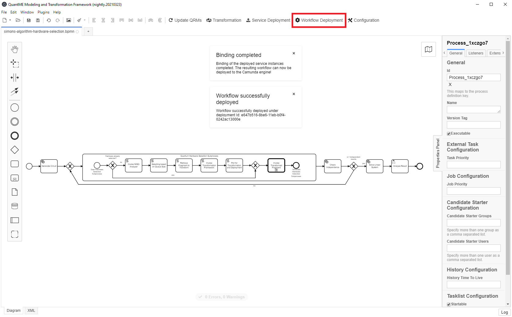

Thereby, another pop-up is displayed after the successful deployment of the workflow model.
If the workflow deployment fails, please have a look at the logs of the Docker-Compose file and the Troubleshooting section at the end of this file.

## Execute the Workflow using the Camunda Engine

After deploying the configured workflow model to the Camunda engine, it can be executed.
For this, open a browser and access the Camunda engine UI using the following URL: ``http://$IP:8080/camunda``
Thereby, $IP has to be replaced with the IP of your Docker engine (see above).
First, create an account and login to the Camunda engine UI.
You should see the following screen:


Switch to the Camunda cockpit application by clicking on the top-right and selecting ``Cockpit``:


If the workflow model was successfully deployed in the last step, a ``1`` should be displayed under the ``Process Definitions`` label.
Click on ``Processes`` on the top to get a list of all deployed workflow models:


Select the example workflow model by clicking on its name, which opens a view where the workflow model is shown.
In this view, the token flow can be observed during workflow execution.
This means, it is visualized which activity of the workflow model is currently executed.
Furthermore, the current values of the different variables in the workflow are displayed.
To execute the workflow, open another tab with the Camunda tasklist application, by clicking on the top-right and selecting ``Tasklist``:

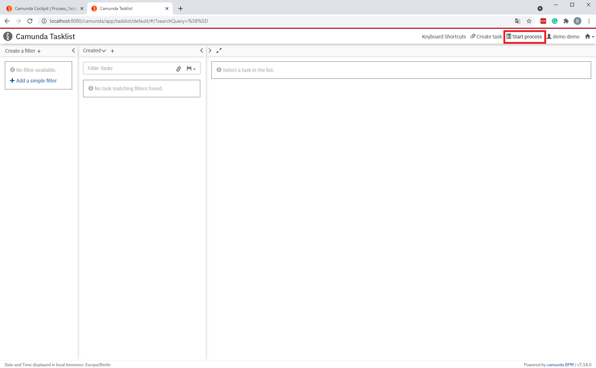

To instantiate the workflow model, select ``Start process`` on the top-right and click on the name of the workflow in the pop-up menu.
Next, the required input parameters for the instantiation are shown:

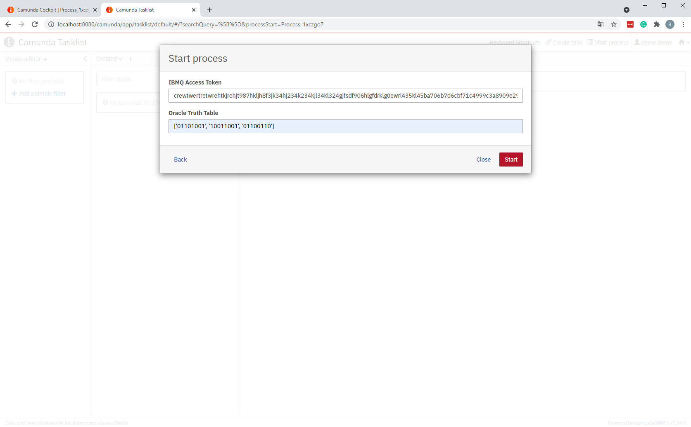

For the instantiation two input parameters are required:

* ``IBMQ Access Token``: The access token from the [IBM Quantum Experience](https://quantum-computing.ibm.com/) to enable the execution on the quantum computers from IBM.
For Rigetti, we currently only use a local simulator, which is deployed using the OpenTOSCA Container if it is chosen during hardware selection.
Thus, no access token for Rigetti is needed. 

* ``Oracle Truth Table``: The truth table defining the oracle that should be used for the workflow execution.
We use the Qiskit functionality for the generation of the corresponding quantum circuits, thus, it can be defined as discussed in the [Qiskit documentation](https://qiskit.org/documentation/stubs/qiskit.aqua.components.oracles.TruthTableOracle.html).
For this example, we use the following truth table ``['01101001', '10011001', '01100110']``, which results in the hidden bit string ``s=011``. 

Enter the input parameters and click on ``Start``.
The UI displays a notification at the bottom-right, that the workflow instance was successfully started.
Switch back to the Camunda cockpit application in the first tab to observe the token flow in the workflow:


In the figure above, the ``Selecting based on Queue Size`` script task is currently executed.
Click on the ID of the workflow instance to display the current values of all variables (refresh the page for updated values):


As shown in the figure above, the hardware selection is finished and the resulting provider and QPU can be seen in the ``selected_provider`` and ``selected_qpu`` variables.
In the example, ``ibmq`` was chosen and the ``simulator_statevector``.
Depending on the problem size, only simulators can successfully execute the quantum circuit as the available quantum computers are too restricted.
Furthermore, based on the set of suitable QPUs and simulators, the one with the shortest queue size is selected, which can be validated by checking the current queue size in the [IBM Quantum Experience](https://quantum-computing.ibm.com/).
As discussed above, for Rigetti we utilize a locally deployed simulator.
Thus, there is no queue for this simulator and to avoid always selecting this simulator, it operates behind a mocked queue of size 5.
Hence, it is only selected if all suitable QPUs and simulators from IBM have a bigger queue size.

When the workflow execution reaches the BPMN call activity, the workflow fragment in the QuantumHardwareSelectionSubprocess was transformed, all required services are deployed, and the resulting workflow model was uploaded to the Camunda engine:

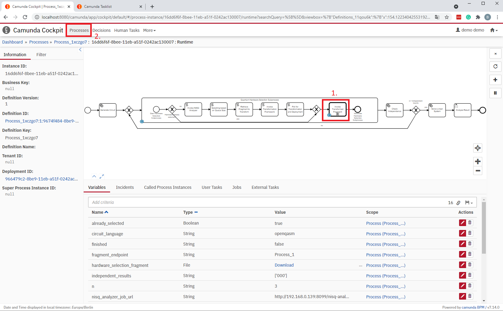

Thus, click on the ``Processes`` button and verify that two workflow models are deployed:

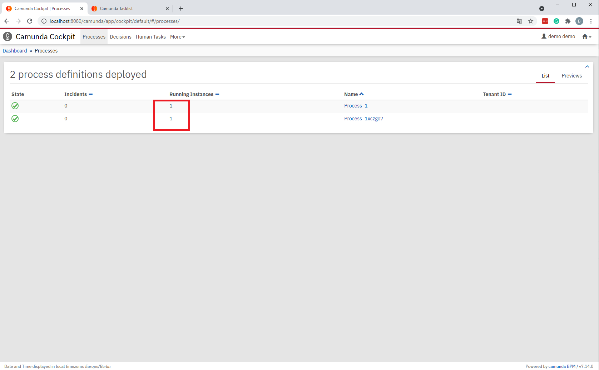

Thereby, you can also enter the second workflow model and analyze the token flow there.
When the workflow terminates, the control is given back to the calling workflow, and it is checked how many results are linearly independent.
Thus, the workflow iterates until *n-1* linearly independent results are retrieved, whereby *n* is the problem size of the given oracle.
However, the hardware selection, transformation, and deployment are only needed in the first iteration.
For all further iterations, the same QPU is used and only the transformed and deployed workflow model is invoked by the call activity.

Wait until the token flow reaches the human task at the end of the workflow as depicted below.
Thereby, for the oracle defined above, two linearly independent results are needed.
However, additional iterations may be required if the same result is retrieved multiple times.

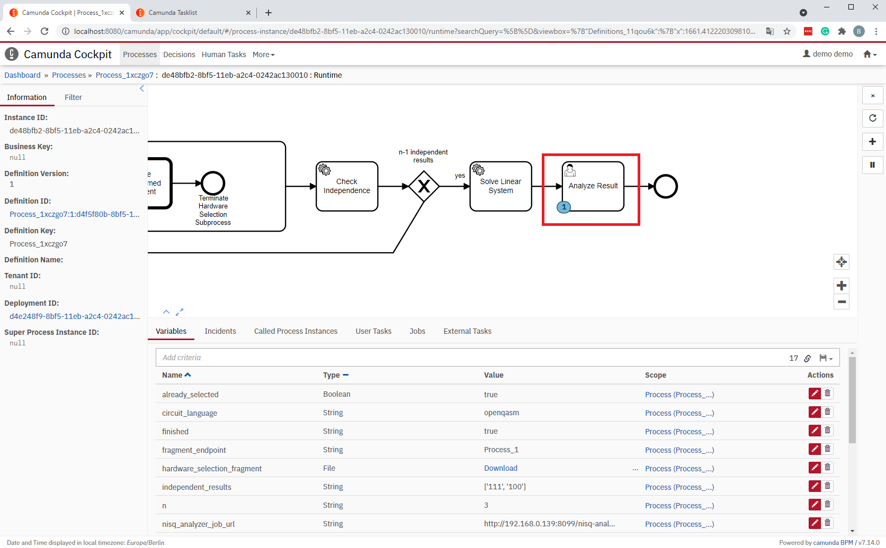

To analyze the resulting bitstring *s* in the human task, switch to the tasklist tab.
Click on ``Add a simple filter`` on the left, and then, the human tasks should be visible in the task list as shown below:

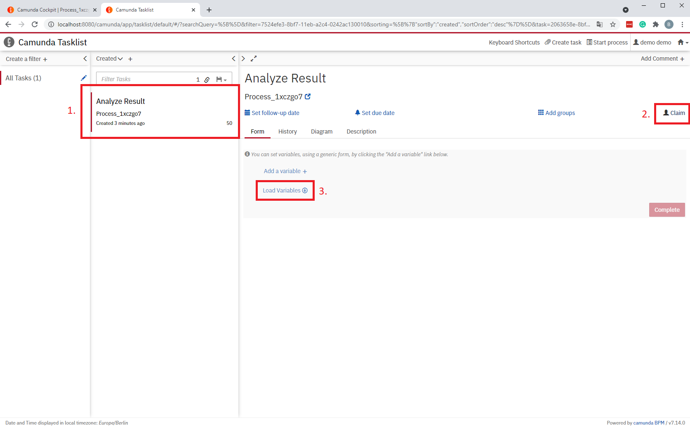

Then, click on the task and the ``Claim`` button on the right.
Finally, click on ``Load Variables``, which displays the value of all variables:


Search for the variable with name ``s``, which has the value ``011`` in our example, providing the solution for Simon's problem and the given oracle.
By pressing the ``Complete`` button, the workflow terminates.

To terminate the environment, close the QuantME Transformation Framework and execute the following command in the [folder](./docker) with the Docker-Compose file: ``docker-compose down -v``

## Troubleshooting

The [docker-compose file](./docker/docker-compose.yml) for the setup of the environment uses the release *v1.1.1* of [QProv](https://github.com/UST-QuAntiL/qprov).
However, the IBMQ API may change over time and the retrieval of the required provenance data does not work as expected anymore.
Therefore, please have a look if a newer relase is available in case you have any issues regarding QProv.

The setup for this use case requires a lot of services from the OpenTOSCA ecosystem, as well as the QuAntil ecosystem.
Thus, make sure the used Docker engine has access to enough resources and increase them, e.g., if the provisioning of a service instance for the different task fails.
