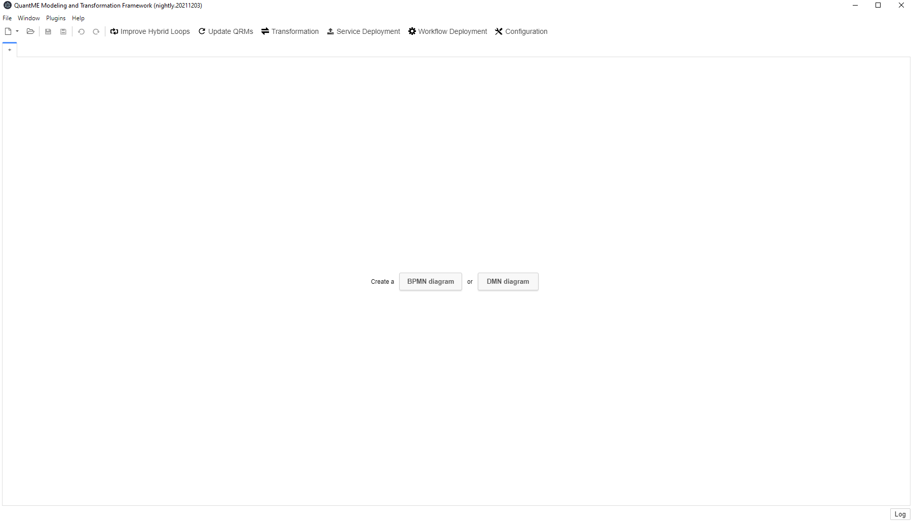
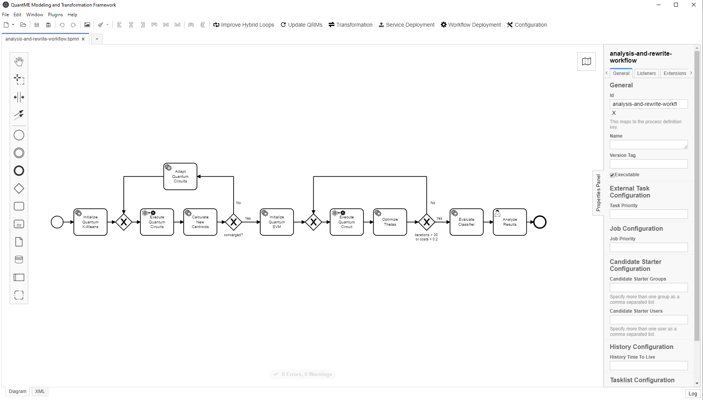
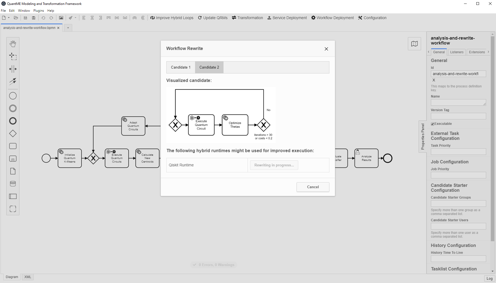
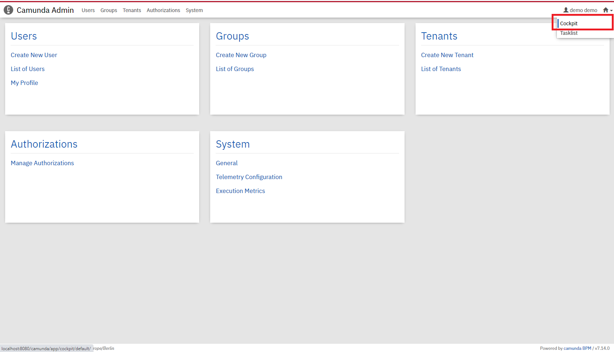
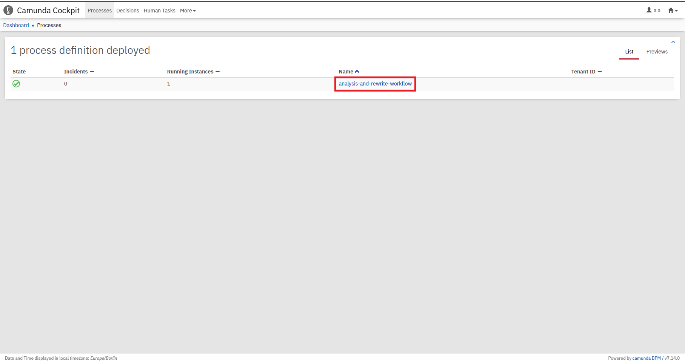
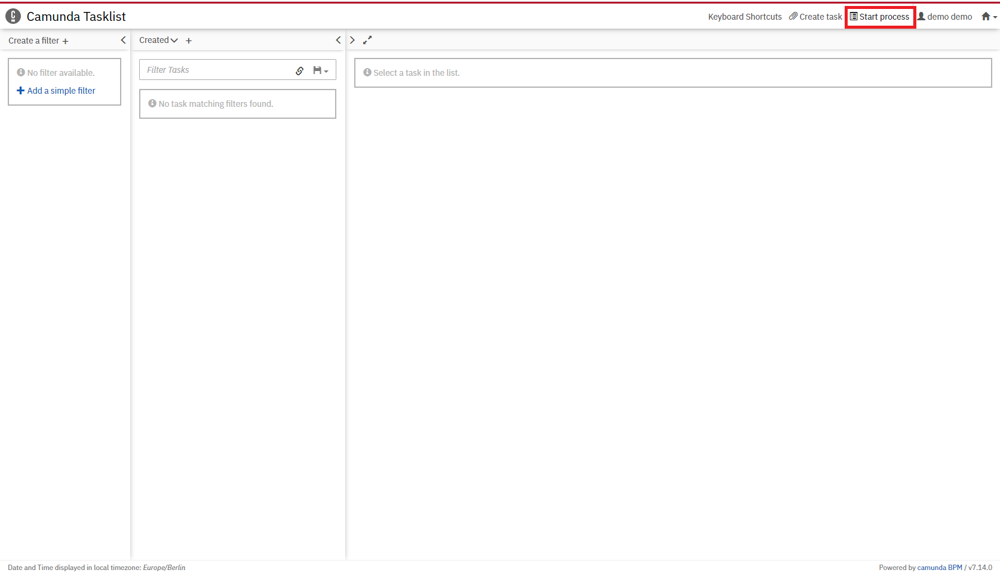
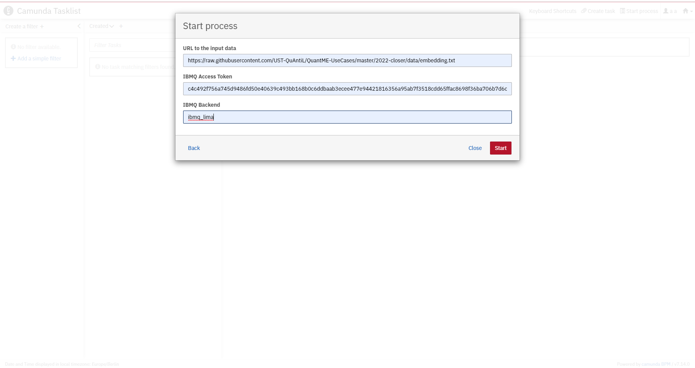

# CLOSER 2022 Prototype

This use case shows how to model quantum workflows independent of a certain runtime to use, analyze them to find workflow fragments that can benefit from a certain runtime, and rewrite the workflow to use these runtimes.
In the following, we focus on so-called *hybrid runtimes*, such as the [Qiskit Runtime](https://quantum-computing.ibm.com/lab/docs/iql/runtime/).
They can be used to upload quantum and classical programs comprising a hybrid quantum algorithm together as *hybrid program*.
Thus, the programs are provisioned close together, and their communication is optimized, which improves the performance of hybrid quantum algorithms performing multiple iterations of quantum and classical processing.

In the following sections, we present the analysis and rewrite method based on the workflow model shown below:


First, [pre-processed data](./data/embedding.txt) is loaded, which is used to initialize a quantum k-means algorithm.
Then, the workflow enters a hybrid loop, executing quantum circuits, calculating new centroids based on the results, and adapting the quantum circuits if needed for the next execution.
This loop ends when the clustering converges, i.e., the difference between the new and old centroids is smaller than a given threshold or the maximum number of iterations is reached.
Next, a variational support vector machine is trained.
This is done using a hybrid loop again, optimizing the parameters theta until the incurred costs are smaller than 0.2 or 30 iterations are executed.
Finally, the variational support vector machine is evaluated by classifying test data, and the resulting figure is displayed to the user in the last user task.

In case you experience any problems during modeling, rewrite, deployment, or execution of the workflow, please refer to the [Troubleshooting](#troubleshooting) section at the end of this README.

## Setting up the MODULO Framework

First, we will discuss the steps required to set up the different components comprising the MODULO framework.
All components except the [QuantME Transformation Framework](https://github.com/UST-QuAntiL/QuantME-TransformationFramework) providing the graphical BPMN modeler are available via Docker.
Therefore, these components can be started using the Docker-Compose file available [here](./docker):

1. Update the [.env](./docker/.env) file with your settings: 
  * ``PUBLIC_HOSTNAME``: Enter the hostname/IP address of your Docker engine. Do *not* use ``localhost``.

2. Run the Docker-Compose file:
```
docker-compose pull
docker-compose up --build
```

3. Wait until all containers are up and running. This may take some minutes.

To start the QuantME Transformation Framework, please execute the following steps:

1. Clone the repository using release v1.4.0: 
```
git clone https://github.com/UST-QuAntiL/QuantME-TransformationFramework.git --branch v1.4.0
```

2. Move to the cloned folder and build the framework:
```
npm install
npm run build
```

3. The build product can be found in the ``dist`` folder and started depending on the operating system, e.g., using the ``.exe`` for Windows.

Afterwards, the following screen should be displayed:



## Analysis and Rewrite of Quantum Workflows

Open the example workflow model available [here]() using the QuantME Transformation Framework.
For this, click on ``File`` in the top-right corner, and afterwards, select the workflow model in the dialogue ``Open File...``.
The following screen is displayed:



In case you want to execute the workflow model without optimization, press the ``Transformation`` Button in the toolbar on the top to retrieve a standard-compliant BPMN workflow model.
Then, directly go to the [Deploying the Required Services](#deploying-the-required-services) section.
However, do *not* perform the transformation if you want to optimize the workflow, as this has to be done before.

To trigger the workflow analysis and rewrite, click on the ``Improve Hybrid Loops`` button on the top.
Then, the following modal is displayed, comprising some information about the analysis and rewrite method:


Press the ``Analyse Workflow`` button to start the detection of hybrid loops within the workflow, which could benefit from a hybrid runtime.
When the analysis finishes, the possible optimization candidates are visualized in the next modal:


In our example workflow, two optimization candidates are detected, one performing the clustering, and the second comprising the classification tasks.
The tabs on the top of the modal can be used to switch between the visualization of all detected optimization candidates:


Furthermore, a list of supported hybrid runtimes is displayed in the table below.
Currently, only the Qiskit Runtime is supported.
Click on the ``Rewrite Workflow`` button to analyze if the selected hybrid runtime supports the current candidate.
If yes, a hybrid program, as well as a corresponding deployment model, are automatically generated for the candidate.
Finally, the workflow is rewritten to invoke the generated hybrid program.
After clicking on the button, the following screen is displayed until the analysis and rewrite terminates, which might take some time:



TODO

## Deploying the Required Services

TODO

## Executing the Quantum Workflow

After successfully deploying all required services and the workflow model, open the URL of the Camunda BPMN engine: ``$PUBLIC_HOSTNAME:8080/camunda``

First, create an account in the Camunda engine and log in. 
Then, the following screen is displayed:



Switch to the Camunda cockpit application by clicking on the top-right and selecting ``Cockpit``:


If the workflow model was successfully deployed in the [deployment step](#deploying-the-required-services), a 1 should be displayed under the ``Process Definitions`` label. 
Click on ``Processes`` on the top to get a list of all deployed workflow models:



Select the previously modeled and deployed workflow model by clicking on its name, which opens a view where the workflow model is shown. 
In this view, the token flow can be observed during workflow execution, i.e., it is visualized which activity of the workflow model is currently executed. 
Furthermore, the current values of the different variables in the workflow are displayed. 
To execute the workflow, open another tab with the Camunda tasklist application by clicking on the top-right and selecting ``Tasklist``:



To instantiate the workflow model, select ``Start process`` on the top-right and click on the name of the workflow in the pop-up menu. 
Next, the required input parameters for the instantiation are shown, which were defined in the start event form of the workflow:



Provide your IBMQ access token, which can be retrieved from the [IBM Quantum Experience website](https://quantum-computing.ibm.com/), as well as one of the QPUs available over IBMQ (``ibmq_lima`` in the example) as input parameters.
Furthermore, the URL to the input data has to be passed as parameter.
Thereby, the [pre-processed data](./data/embedding.txt) is available in this repository, and thus, the following URL dan be used: ``https://raw.githubusercontent.com/UST-QuAntiL/QuantME-UseCases/master/2022-closer/data/embedding.txt``

After entering the input parameters, click on ``Start``.
The UI displays a notification at the bottom-right that the workflow instance was successfully started.
Switch back to the Camunda cockpit application to observe the token flow in the workflow:

TODO

To terminate the environment, execute the following command in the [folder](./docker) with the Docker-Compose file: ``docker-compose down -v``
Furthermore, you can delete the uploaded hybrid programs either using Qiskit and the ``IBMRuntimeService.delete_program()`` method (see [here](https://github.com/Qiskit-Partners/qiskit-runtime/blob/main/tutorials/02_uploading_program.ipynb)) or the [Qiskit Runtime API](https://runtime-us-east.quantum-computing.ibm.com/openapi/#/).

## Troubleshooting

Qiskit Runtime is currently [based on the latest Qiskit version](https://quantum-computing.ibm.com/lab/docs/iql/runtime/start).
This means, also the generated hybrid programs must be compatible with the latest Qiskit version.
As the hybrid programs are generated from the quantum and classical programs, their used Qiskit version influences the Qiskit version of the hybrid programs.
Thus, the generated hybrid programs might fail if there are breaking changes in newer Qiskit versions.
The provided programs are based on version 0.32.1, please visit the [Qiskit release page](https://qiskit.org/documentation/release_notes.html) in case you experience any problems, and check for possible changes.

The setup starts overall 7 Docker containers, and the required services are deployed within one of these containers using so-called [Docker-in-Docker (dind)](https://github.com/jpetazzo/dind).
Thus, if the startup of the Docker-Compose file or the deployment of the services fails, please make sure to provide enough resources to the docker engine, i.e., CPU, main memory, and disk space.
