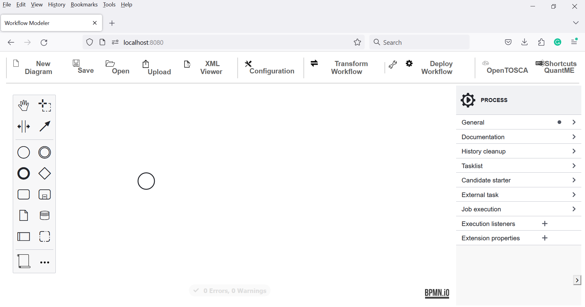
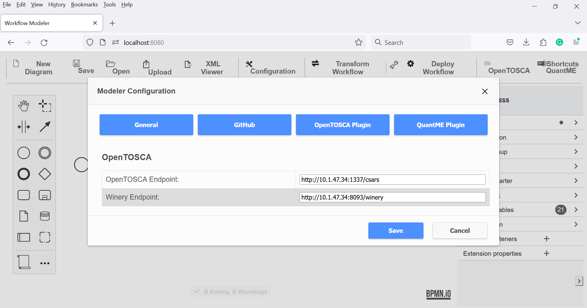
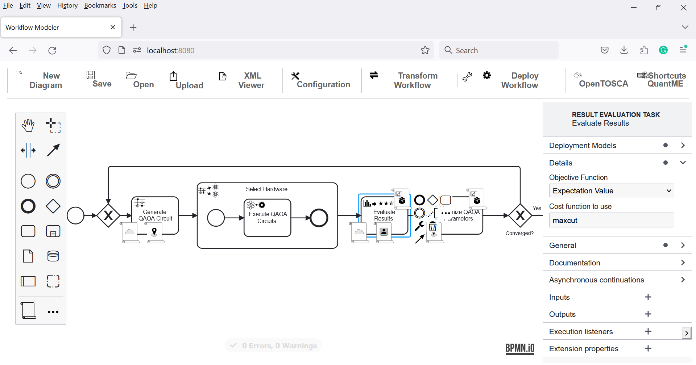
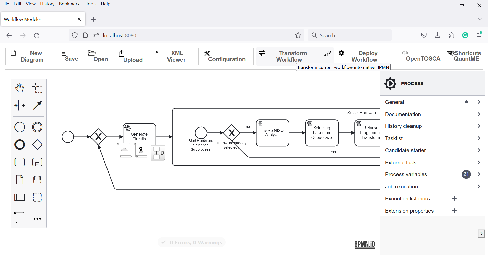
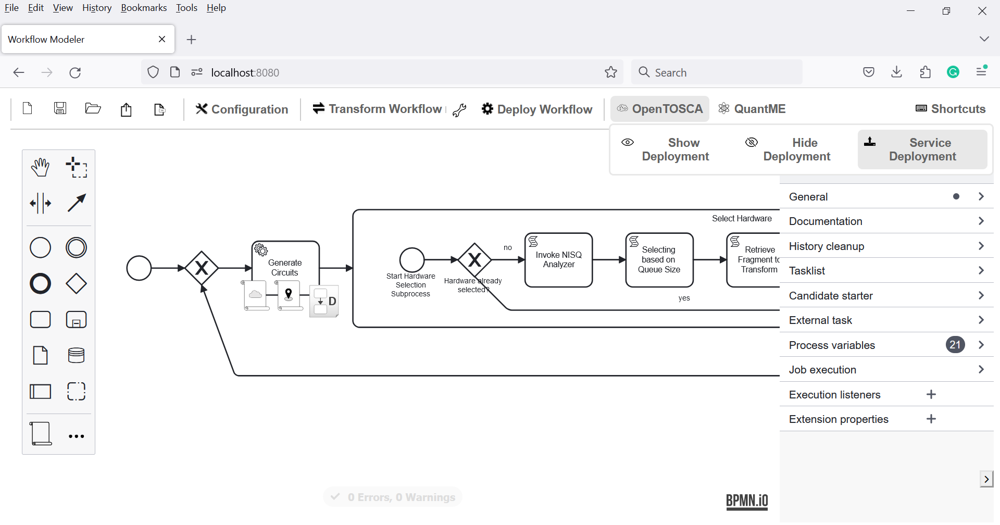
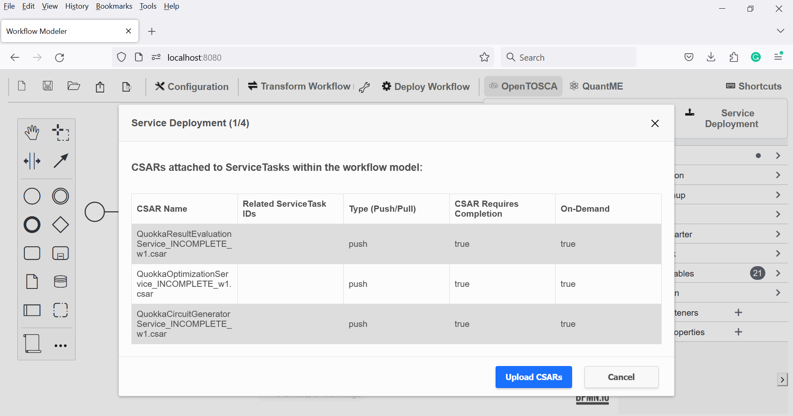
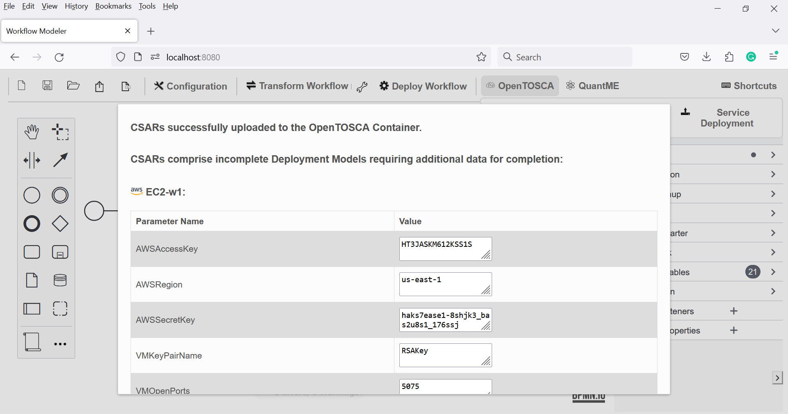
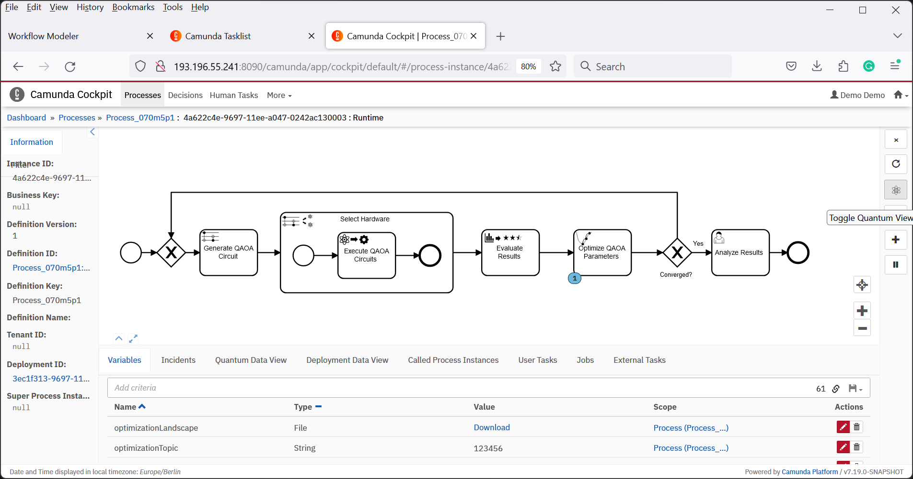

# CAiSE 2024 Prototype

Quantum workflows enable a robust, scalable, and reliable orchestration of hybrid applications comprising classical and quantum tasks.
Varying availability and pricing of classical infrastructure and quantum devices promote adaptive deployments of required functionalities.
While workflow engines enable to execute, monitor, and analyze quantum workflows, visualizing the information relevant to each specific user group is challenging, particularly within heterogeneous and adaptive multi-cloud environments.
To overcome this issue, we present an approach enabling unified observability of quantum workflows, including details of the classical services and infrastructure, as well as the current characteristics of used quantum devices.
To this end, we introduce different process views that facilitate workflow monitoring and analysis for quantum and deployment experts.

In the following sections, we showcase our approach, as well as the quantum and deployment view for an exemplary variational quantum algorithm that solves the Maximum Cut (MaxCut) problem using the [Quantum Approximate Optimization Algorithm (QAOA)](https://arxiv.org/pdf/1411.4028.pdf).

A video showcasing the described use case is available on YouTube:

[](https://www.youtube.com/watch?v=XpChXXgAr_0)

The use case utilizes the following components:

* [Quantum Workflow Modeler](https://github.com/PlanQK/workflow-modeler): A graphical BPMN modeler to define, transform, and deploy quantum workflows.
* [Quokka](https://github.com/UST-QuAntiL/Quokka): A microservice ecosystem enabling a service-based execution of quantum algorithms.
* [Camunda BPMN Engine](https://camunda.com/products/camunda-platform/bpmn-engine/): A state-of-the-art BPMN workflow engine used to execute quantum workflows after transforming them to native BPMN workflow models to avoid the need for extending the workflow engine.
* [Winery](https://github.com/OpenTOSCA/winery): Winery is a web-based environment to graphically model TOSCA-based deployment models, which can then be attached to activities of quantum workflows to enable their automated deployment in the target environment.
* [OpenTOSCA Container](https://github.com/OpenTOSCA/container): A TOSCA-compliant deployment system to deploy and manage applications or services.


## Setup

To set up the required components for the use case, a machine with a publicly accessible IP is required, e.g., hosted in the cloud.
All components are available via Docker.
Therefore, these components can be started using the Docker-Compose file available [here](./docker):

1. Update the [.env](./docker/.env) file with your settings:
  * ``PUBLIC_HOSTNAME``: Enter the publicly accessible IP address of your Docker engine. Do *not* use ``localhost``.
  * ``IBM_ACCESS_TOKEN``: Enter your IBMQ token, which can be retrieved [here](https://quantum-computing.ibm.com/).

2. Run the Docker-Compose file:
```
docker-compose pull
docker-compose up --build
```

3. Wait until all containers are up and running. This may take some minutes.

Open the Quantum Workflow Modeler using the following URL: [localhost:8080](http://localhost:8080)

Afterward, the following screen should be displayed:



Open the example workflow model available [here](./workflow/caise_workflow.bpmn) using the Quantum Workflow Modeler.
For this, click on ``Open`` in the top-left corner, and afterward, select the workflow model.
Then, the following screen is displayed:


The Quantum Workflow Modeler is pre-configured with the endpoints of the workflow engine and the QRM repository.
To check these settings, click on ``Configuration`` in the toolbar, opening the config pop-up:



Please verify that the different configuration properties are set to the following values.
Thereby, $IP has to be replaced with the IP address of the Docker engine used for the setup described above:

* Under ``General``:
    * ``Camunda Engine Endpoint``: http://$IP:8080/engine-rest
* Under ``GitHub``:
    * ``QRM Repository User``: UST-QuAntiL
    * ``QRM Repository Name``: QuantME-UseCases
    * ``QRM Repository Path``: 2024-caise/qrms
* Under ``QuantME Plugin``:
    * ``OpenTOSCA Endpoint:``: http://$IP:1337/csars
    * ``Winery Endpoint:``: http://$IP:8093/winery
* Under ``OpenTOSCA Plugin``:
    * ``QuantME Framework Endpoint``: http://$IP:8888
    * ``QProv Endpoint``: http://$IP:8094/qprov

### Configuring, Transforming, and Executing the Quantum Workflow

The imported workflows starts of with gateway defining the loop used for optimizing the circuit parameters of the variational quantum algorithm.
The first task within the loop, generates the QAOA circuit with the initial parameters, which is subsequently executed by a quantum circuit execution task.
Afterward, the circuit execution result is evaluated.
Next, the circuit parameters are optimized based on the evaluated results and another iteration of the loop is started with new parameters suggested by the optimization service.
Once the optimization is converged, the result is returned to the user for analysis.

The import workflow also comprises several policies which are attached to QuantME tasks.
These policies change the semantics of a service's deployment.
For example can an *on-demand* policy be attached, which enforces the service used by the task to be deployed during runtime, right before the service is invoked.
Another example is the *cloud type* policy, which enables the user to specify the desired cloud type, e.g., private or public cloud, for incomplete deployment models.

QuantME enables the configuration of quantum-specific properties panel (see on the right).



To execute the workflow, the QuantME modeling constructs must be replaced by standard-compliant BPMN modeling constructs.
Therefore, click on the ``Transform Workflow`` button.

The resulting native workflow model is displayed below.
For example, the Quantum Circuit Loading Task is replaced by a Service Tasks which has a suitable deployment model for provisioning the service attached to it.



Furthermore, all policies need to be replaced by suitable standard-compliant constructs accomplishing their semantics.
Hence, the service deployment need to be adjusted by clicking ``OpenTOSCA`` and then ``Service Deployment``.



As a result an overview of the deployment requirements is shown highlighting which of the deployment models are incomplete and which should be deployed on demand.



Next click on ``Upload CSARs`` to upload complete deployment models.
In case incomplete deployment models are contained in the workflow, the next menu shows an overview of available nodetypes that have required attributes.
All nodetypes whose required attributes are not filled, will be excluded from the topology completion, possibly resulting in completion errors.



Afterward, click on ``Deploy Services`` and then on ``Transform Workflow`` to add the logic for on-demand deployment to the workflow.
Now all service tasks, which should be deployed on demand are replaced by sub-processes containing tasks for deploying the service, as well as the service invocation.


Next, deploy the workflow to the workflow-engine by clicking the ``Deploy Workflow`` button.


Open the Camunda Engine using the following URL: [localhost:8090](http://localhost:8090)
Use ``demo`` as username and password to log in, which displays the following screen:


Click on the home icon in the top-right corner and select ``Cockpit`` to validate that the workflow was successfully uploaded.
Then, click on ``Processes`` on the top-left and select the workflow from the list.
This should show a graphical representation of the uploaded workflow:


To instantiate the workflow, click the home button on the top-right, then select ``Tasklist``.
Next, click on ``Start process`` on the top-right, select the name of the uploaded workflow, and provide the input parameters:


The UI displays a notification at the bottom-right that the workflow instance was successfully started.
Afterward, once more, click on the home icon on the top-right and select Cockpit.
Click on the Running Process Instance, select the started workflow, and then click on the workflow ID.
Now the workflow's token flow and the changing variables can be observed. To see the current state of the workflow instance refresh the page.

Initially the deployment view of the started process instance is shown, enabling users to observe the topologies of deployed services, as well as their state and characteristics.


By clicking on the ``Quantum View`` button on the right-hand side, the originally modeled untransformed quantum workflow is shown.



## Disclaimer of Warranty
Unless required by applicable law or agreed to in writing, Licensor provides the Work (and each Contributor provides its Contributions) on an "AS IS" BASIS, WITHOUT WARRANTIES OR CONDITIONS OF ANY KIND, either express or implied, including, without limitation, any warranties or conditions of TITLE, NON-INFRINGEMENT, MERCHANTABILITY, or FITNESS FOR A PARTICULAR PURPOSE. You are solely responsible for determining the appropriateness of using or redistributing the Work and assume any risks associated with Your exercise of permissions under this License.

## Haftungsausschluss
Dies ist ein Forschungsprototyp. Die Haftung für entgangenen Gewinn, Produktionsausfall, Betriebsunterbrechung, entgangene Nutzungen, Verlust von Daten und Informationen, Finanzierungsaufwendungen sowie sonstige Vermögens- und Folgeschäden ist, außer in Fällen von grober Fahrlässigkeit, Vorsatz und Personenschäden, ausgeschlossen.
