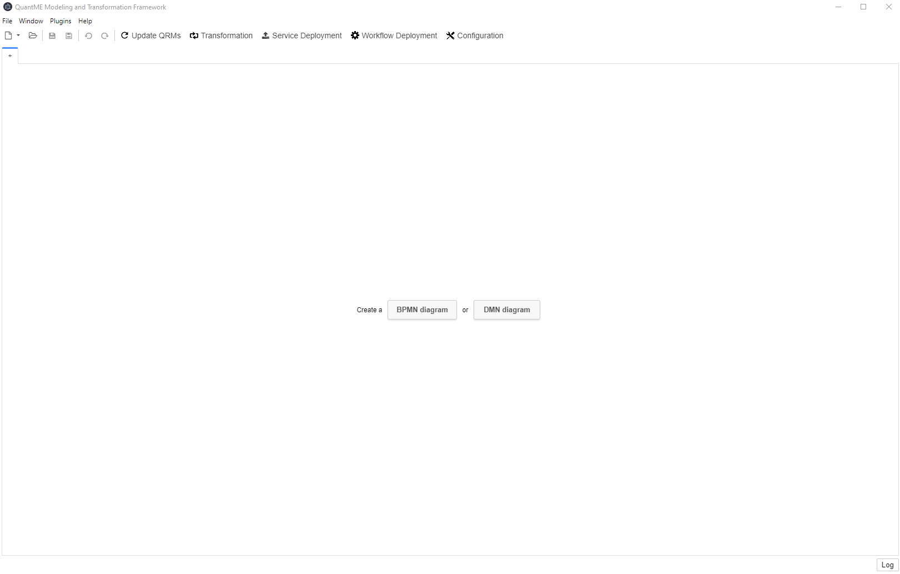

# TODO

TODO

In case you experience any problems during modeling, rewrite, deployment, or execution of the workflow, please refer to the [Troubleshooting](#troubleshooting) section at the end of this README.

## Setting up the MODULO Framework

First, we will discuss the steps required to set up the different components comprising the MODULO framework.
All components except the [QuantME Transformation Framework](https://github.com/UST-QuAntiL/QuantME-TransformationFramework) providing the graphical BPMN modeler are available via Docker.
Therefore, these components can be started using the Docker-Compose file available [here](./docker):

1. Update the [.env](./docker/.env) file with your settings: 
  * ``PUBLIC_HOSTNAME``: Enter the hostname/IP address of your Docker engine. Do *not* use ``localhost``.

2. Run the Docker-Compose file:
```
docker-compose pull
docker-compose up --build
```

3. Wait until all containers are up and running. This may take some minutes.

To start the QuantME Transformation Framework, please execute the following steps:

1. Clone the repository using release v1.4.0: 
```
git clone https://github.com/UST-QuAntiL/QuantME-TransformationFramework.git --branch v1.4.0
```

2. Move to the cloned folder and build the framework:
```
npm install
npm run build
```

3. The build product can be found in the ``dist`` folder and started depending on the operating system, e.g., using the ``.exe`` for Windows.

Afterwards, the following screen should be displayed:



## TODO

TODO

## Troubleshooting

Qiskit Runtime is currently [based on the latest Qiskit version](https://quantum-computing.ibm.com/lab/docs/iql/runtime/start).
This means, also the generated hybrid programs must be compatible with the latest Qiskit version.
As the hybrid programs are generated from the quantum and classical programs, their used Qiskit version influences the Qiskit version of the hybrid programs.
Thus, the generated hybrid programs might fail if there are breaking changes in newer Qiskit versions.
The provided programs are based on version 0.32.1, please visit the [Qiskit release page](https://qiskit.org/documentation/release_notes.html), in case you experience any problems, and check for possible changes.

TODO
